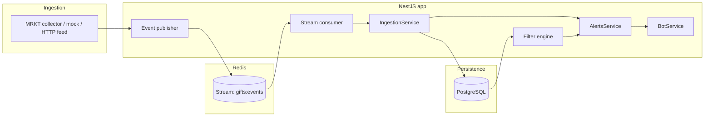

# Gift Sniper

**Gift Sniper** is a backend service that watches Telegram gift marketplaces (starting with **MRKT**), scores new listings against floor price, streams normalized events through **Redis**, persists them in **PostgreSQL**, and notifies subscribed users via a **Telegram bot** (grammY) with configurable filters—including a deep link to open the gift in the MRKT Mini App.

---

## What it does

1. **Ingest** MRKT sale listings (native `api.tgmrkt.io`, optional HTTP JSON feed, or built-in **mock** data for development).
2. **Normalize** each listing into a canonical event shape (collection, gift name, price, floor, discount %, rarity hints, seller, etc.).
3. **Publish** events to a **Redis Stream** so consumers can scale independently.
4. **Persist** gifts, listings, and events with **Prisma**; compute a **sniper score** for ranking.
5. **Match** listings against per-user **filters** (markets, min discount below floor, optional price band, min sniper score).
6. **Alert** matching users on Telegram; messages include price/floor/discount and a **Telegram MRKT Mini App link** that opens the gift (`https://t.me/mrkt/app?startapp=<slug>-<serial>` when a serial is known, otherwise `startapp=<api_gift_id>`).
7. **Operate** a Telegram bot for `/start`, filter tuning, mute/unmute, and `/status`.
8. **Emit metrics** (Prometheus + JSON), optional **fast-path Telegram alerts** from the MRKT collector, **Socket.IO** `listing` events after DB persist, **admin stats + stream replay**, and **beautiful-serial** detection (extra engagement message).

See **[ROADMAP.md](./ROADMAP.md)** for product/engineering priorities and what is stubbed vs shipped.

---

## Architecture



| Layer | Responsibility |
|--------|----------------|
| **Collectors** | MRKT: native **`POST /gifts/saling`** when `MRKT_TOKEN` or `MRKT_INIT_DATA` is set (full `gifts[]`); optional GET `MRKT_LISTINGS_URL` only as fallback or if `MRKT_PREFER_HTTP_FEED=1`; mock when nothing is configured. |
| **Events** | Build `NormalizedMarketEvent`, push to Redis stream (`EVENT_STREAM_KEY`). |
| **Pipeline** | `StreamConsumerService`: XREADGROUP, parse JSON, hand off to ingestion. |
| **Ingestion** | Upsert `Gift` / `GiftListing`, write `GiftEvent`, trigger alerts. |
| **Filters** | JSON criteria per `UserFilter`; `FilterEngineService.matches()`. |
| **Alerts** | Redis dedupe per user+event, optional free-tier delay, `BotService.sendMessage`. |
| **Bot** | grammY long polling after HTTP `listen`; `/start` registers user + default filter; commands for `/filter`, `/status`, `/mute`, `/unmute`, `/help`. |
| **Health** | `GET /health` — DB ping, token configured, `bot.isRunning()`. |

---

## Tech stack

| Area | Choice |
|------|--------|
| Runtime | Node.js 22 |
| Framework | NestJS 10, TypeScript |
| HTTP | Express (via `@nestjs/platform-express`) |
| Database | PostgreSQL 16 + Prisma 6 |
| Cache / stream | Redis 7 (streams + dedupe keys) |
| Telegram | grammY (long polling; `startLongPolling()` after `app.listen`) |
| Realtime | Socket.IO (`@nestjs/platform-socket.io`; `IoAdapter` in `main.ts`) |
| Containers | Docker Compose (`app`, `postgres`, `redis`) |

---

## Repository layout

| Path | Purpose |
|------|---------|
| `src/collectors/mrkt/` | MRKT API client, mapper, collector, types. |
| `src/collectors/tonnel/`, `src/collectors/portals/` | Placeholder collectors for future markets. |
| `src/metrics/` | Counters + latency summaries; `/metrics` + `/metrics/json`. |
| `src/realtime/` | `AppEventBus` + `EventsGateway` (Socket.IO). |
| `src/admin/` | Stats + Redis stream replay (token-guarded). |
| `src/intelligence/` | Whale + collection analytics **stubs** for future intelligence layers. |
| `src/lib/` | Shared helpers (e.g. beautiful-serial analysis). |
| `src/events/` | Normalized event types + stream helpers. |
| `src/pipeline/` | Redis stream consumer. |
| `src/ingestion/` | DB writes + alert fan-out. |
| `src/filters/` | Criteria schema + match engine. |
| `src/alerts/` | Dedupe, formatting (incl. MRKT gift link), Telegram send. |
| `src/bot/` | Telegram bot service + module. |
| `src/health/` | `GET /health`. |
| `src/config/` | `validateEnv` (class-validator). |
| `src/redis/` | `REDIS_CLIENT` token in `redis.constants.ts` (avoids circular import with `RedisModule`). |
| `prisma/` | Schema + migrations. |
| `scripts/` | `sync-env.cjs`, `mock-feed.ts`. |
| `.github/workflows/ci-cd.yml` | Docker build on push/PR; SSH deploy to `/opt/gift-sniper` on `main`. |

---

## Quick start

### Prerequisites

- Node.js 20+ (repo targets 22 in Docker)
- npm
- Docker Desktop (optional, for full stack)

### Local (API only on host DB/Redis)

```bash
cp .env.example .env
# Edit .env: DATABASE_URL, REDIS_URL, TELEGRAM_BOT_TOKEN, MRKT_* as needed
npm ci
npx prisma migrate dev
npm run start:dev
```

App listens on `PORT` (default **3000**). Telegram polling starts after HTTP bind (`src/main.ts`).

### Docker Compose (recommended)

```bash
cp .env.example .env
# Compose overrides DATABASE_URL and REDIS_URL inside the app container.
# Set TELEGRAM_BOT_TOKEN, MRKT_TOKEN or MRKT_INIT_DATA (or leave MRKT empty for mock).
npm run docker:up
```

- App **inside** container: port **3000**.
- Published host port: **`APP_PORT`** (default **3010**), e.g. `http://localhost:3010/health`.

### Prisma

```bash
npx prisma migrate dev    # local dev migrations
npx prisma studio           # optional UI
```

Production container runs `prisma migrate deploy` in `docker-entrypoint.sh` before `node dist/main.js`.

---

## Environment variables

Copy from `.env.example`. Values are validated at boot (`src/config/env.validation.ts`).

| Variable | Required | Description |
|----------|----------|-------------|
| `DATABASE_URL` | Yes | Postgres connection string. |
| `REDIS_URL` | Yes | Redis connection string. |
| `TELEGRAM_BOT_TOKEN` | For bot | Bot token from @BotFather. **Must be non-empty in production**; compose can pass it via `TELEGRAM_BOT_TOKEN: ${TELEGRAM_BOT_TOKEN:-}` — empty host interpolation overrides `env_file` with blank. |
| `APP_PORT` | No | Host port mapped to container 3000 (default **3010**). |
| `PORT` | No | Port inside container (compose sets **3000**). |
| `LOG_TELEGRAM_UPDATES` | No | Set to `1` to log each incoming update (debug). |
| `TELEGRAM_DROP_PENDING_UPDATES` | No | Set to `1` to drop pending updates once on `deleteWebhook` (recovery from duplicate pollers). |
| `MRKT_LISTINGS_URL` | No | **Fallback** GET JSON when native MRKT auth is **not** set. If `MRKT_TOKEN` / `MRKT_INIT_DATA` is set, native API is used unless `MRKT_PREFER_HTTP_FEED=1`. |
| `MRKT_PREFER_HTTP_FEED` | No | Set to `1` to force `MRKT_LISTINGS_URL` over native API (legacy; slim feeds → missing traits). |
| `MRKT_API_BASE` | No | Default `https://api.tgmrkt.io/api/v1`. |
| `MRKT_TOKEN` / `MRKT_INIT_DATA` | One for native API | Session for **`POST /gifts/saling`** (full objects, same as other MRKT bots). |
| `MRKT_SALING_JSON` | No | JSON merged into saling POST body. |
| `MRKT_SALING_MAX_PAGES` | No | Pagination cap (default 3). |
| `MRKT_POLL_MS` | No | Poll interval (default 2000). |
| `MRKT_USER_AGENT` | No | Optional UA for MRKT HTTP. |
| `EVENT_STREAM_KEY` | No | Redis stream key (default `gifts:events:v1`). |
| `ALERT_DEDUPE_TTL_SEC` | No | Redis NX dedupe TTL for alerts (default 300). |
| `FREE_TIER_ALERT_DELAY_MS` | No | Delay before sending to `free` tier users (default 0). |
| `ADMIN_TOKEN` | No | Enables `GET /admin/stats` + `POST /admin/replay` when set (use header `X-Admin-Token`). |
| `FAST_ALERT_FROM_COLLECTOR` | No | Default on; set to `0` to disable collector-side Telegram alerts (ingestion-only). |
| `ALERTS_FROM_FAST_PATH_ONLY` | No | Set to `1` to skip ingestion-side alerts (collector fast-path only). **Requires** `FAST_ALERT_FROM_COLLECTOR` not disabled, or you will get no alerts. |
| `TONNEL_ENABLED` / `PORTALS_ENABLED` | No | Set to `1` to log stub collector warnings until APIs are wired. |

`npm run env:sync` merges new keys from `.env.example` into `.env` without overwriting values.

---

## Telegram bot

| Command | Description |
|---------|-------------|
| `/start` | Register user, default MRKT filter (e.g. ≥5% below floor), default alert filter row. |
| `/filter below <pct> [minTon] [maxTon]` | Update default filter. |
| `/status` | Tier + default filter JSON. |
| `/mute` / `/unmute` | Toggle `alertsEnabled` on user filters. |
| `/help` | Command list. |

Alerts are plain text; listing alerts include **Open gift:** `https://t.me/mrkt/app?startapp=…` for MRKT — `startapp` is `{collection_slug}-{serial}` (e.g. `sakura-8957`) when `serial_number` is present, else the API `gift_id`.

---

## CI/CD

Workflow: `.github/workflows/ci-cd.yml`.

- **CI:** Docker image build on push / PR to `main`.
- **CD:** On push to `main` (or manual `workflow_dispatch`), SSH to the server, `git pull` in **`/opt/gift-sniper`**, optional `.env` upload from secret **`SERVER_DOTENV_B64`**, `docker compose up -d --build`.

Secrets: `SSH_HOST`, `SSH_USER`, `SSH_PRIVATE_KEY`, optional `SERVER_DOTENV_B64`.

**SSH note:** If `root` login was disabled on the droplet, connect as **`deploy`** with the same key that used to work for root (see `scripts/revert-ssh-hardening-as-root.sh` to allow root again via the cloud console). IDE “All configured authentication methods failed” usually means **wrong user** (`root` instead of `deploy`) or **wrong `IdentityFile`** in `~/.ssh/config`.

---

## Operations

- **Health:** `GET /health` → `{ ok, database, telegramTokenConfigured, telegramLongPolling }`.
- **Metrics:** `GET /metrics` (Prometheus text), `GET /metrics/json` (snapshot counters & latency summaries).
- **Admin (optional):** set `ADMIN_TOKEN` in `.env`, then `GET /admin/stats` or `POST /admin/replay` with header `X-Admin-Token: <ADMIN_TOKEN>`. Replay body: `{ "max": 50 }` (replays newest entries from the Redis stream through ingestion; safe with existing `eventUuid` dedupe).
- **Realtime:** Socket.IO server (default namespace) emits `listing` payloads `{ event, sniperScore, ingestedAt }` after each successful listing persist.
- **Mini App host (`game.*`):** TLS + nginx are not managed by this repo. After DNS points at the server, run **`sudo bash /opt/gift-sniper/scripts/bootstrap-game-subdomain-as-root.sh`** once as **root** (cloud console). That installs a limited sudo rule for `deploy` and runs **`scripts/provision-game-subdomain.sh`** (nginx + Let’s Encrypt for `game.foryou.quest` → `127.0.0.1:3010`). To undo earlier SSH lockdown only (restore **`PermitRootLogin yes`**, drop **`deploy-provision-game`** sudoers): **`scripts/revert-ssh-hardening-as-root.sh`** as root.
- **Logs (Compose):** `npm run docker:logs` or `docker compose logs -f app`.
- **Common production issues:** Empty `TELEGRAM_BOT_TOKEN` in server `.env`; another process long-polling the same token (409 / no updates); Redis DI requires **`redis.constants.ts`** import path (do not import `REDIS_CLIENT` only from `redis.module.ts` alongside `RedisService` — circular).

---

## Scripts (package.json)

| Script | Purpose |
|--------|---------|
| `npm run build` | Nest compile to `dist/`. |
| `npm run start:dev` | Watch mode. |
| `npm run start:prod` | `node dist/main.js`. |
| `npm run mock:feed` | Push sample events (dev). |
| `npm run docker:up` / `docker:down` / `docker:logs` | Compose helpers. |

---

## License

Private project (`"private": true` in `package.json`). All rights reserved unless otherwise stated by the repository owner.
